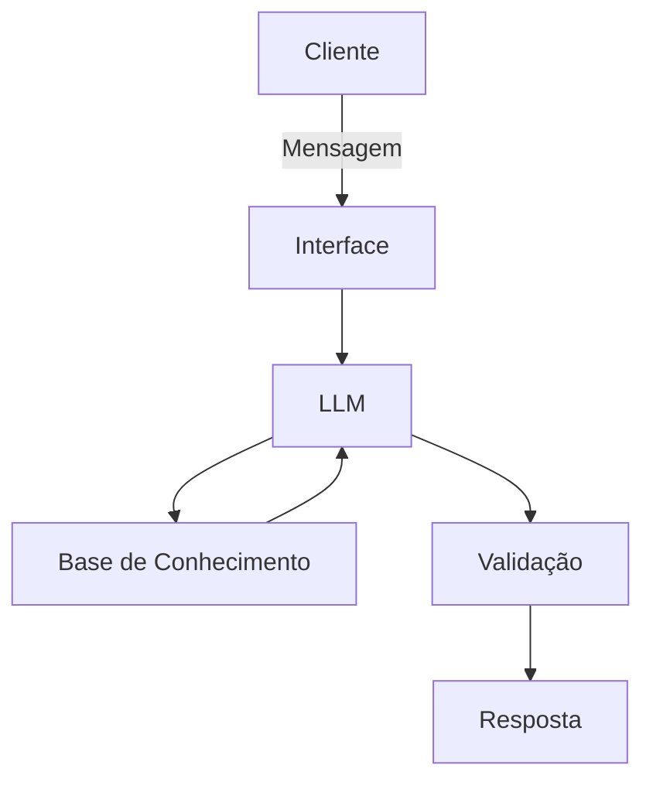

# Documentação do Agente

## Caso de Uso

### Problema

[Pessoas que querem começar a investir frequentemente não sabem qual tipo/categoria de produto financeiro é compatível com seu próprio perfil de risco. Conteúdo genérico (redes sociais, buscas rápidas) não considera o perfil individual, e decidir sem esse alinhamento leva a escolhas desproporcionais ao apetite a risco real da pessoa.]

### Solução

[O agente conduz uma conversa curta para levantar o perfil de risco do usuário (tolerância a perda, prazo do objetivo, experiência prévia) e, com base nisso, explica quais categorias de produtos financeiros tendem a ser mais adequadas, sem recomendar produto ou instituição específica, mantendo caráter educativo e não consultivo.]

### Público-Alvo

[Qualquer pessoa interessada em investir, com ou sem experiência prévia, que queira entender qual tipo de produto combina com seu perfil antes de buscar uma decisão específica com uma instituição financeira.Sua descrição aqui]

---

## Persona e Tom de Voz

### Nome do Agente
[Nome escolhido]

### Personalidade
> Como o agente se comporta? (ex: consultivo, direto, educativo)

[Sua descrição aqui]

### Tom de Comunicação
> Formal, informal, técnico, acessível?

[Sua descrição aqui]

### Exemplos de Linguagem
- Saudação: [ex: "Olá! Como posso ajudar com suas finanças hoje?"]
- Confirmação: [ex: "Entendi! Deixa eu verificar isso para você."]
- Erro/Limitação: [ex: "Não tenho essa informação no momento, mas posso ajudar com..."]

---

## Arquitetura

### Diagrama

### Componentes

| Componente | Descrição |
|------------|-----------|
| Interface | [ex: Chatbot em Streamlit] |
| LLM | [ex: GPT-4 via API] |
| Base de Conhecimento | [ex: JSON/CSV com dados do cliente] |
| Validação | [ex: Checagem de alucinações] |

---

## Segurança e Anti-Alucinação

### Estratégias Adotadas

- [ ] [ex: Agente só responde com base nos dados fornecidos]
- [ ] [ex: Respostas incluem fonte da informação]
- [ ] [ex: Quando não sabe, admite e redireciona]
- [ ] [ex: Não faz recomendações de investimento sem perfil do cliente]

### Limitações Declaradas
> O que o agente NÃO faz?

[Liste aqui as limitações explícitas do agente]
